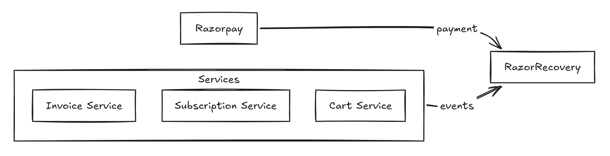
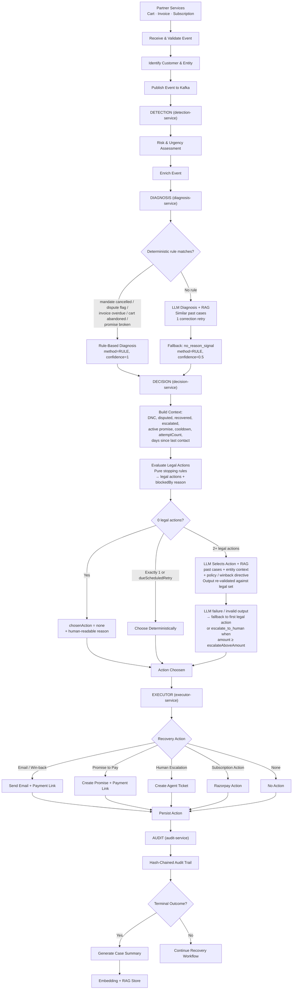
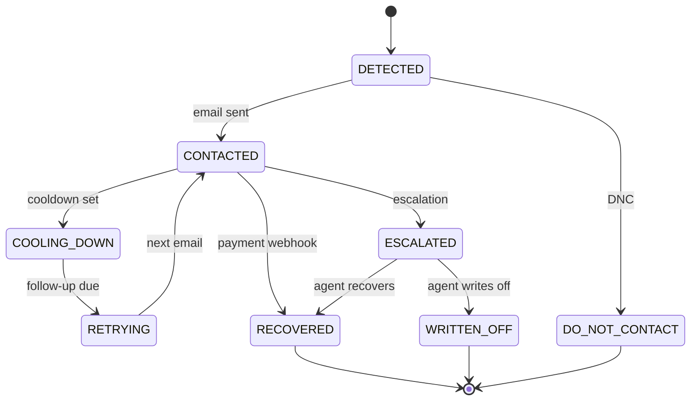
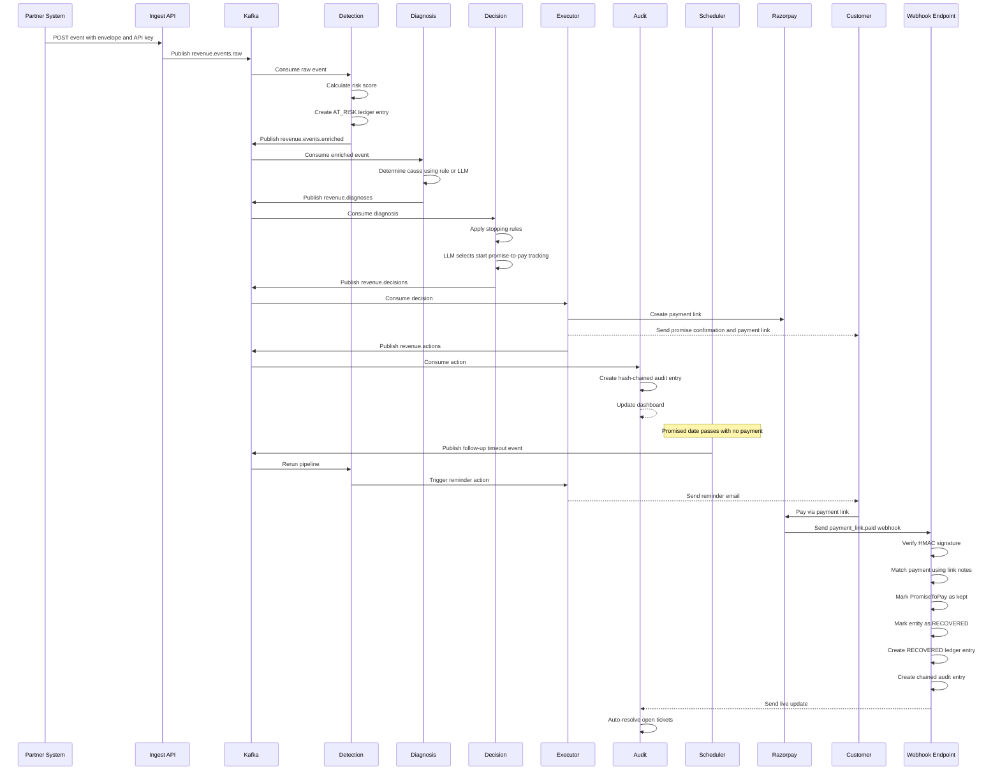
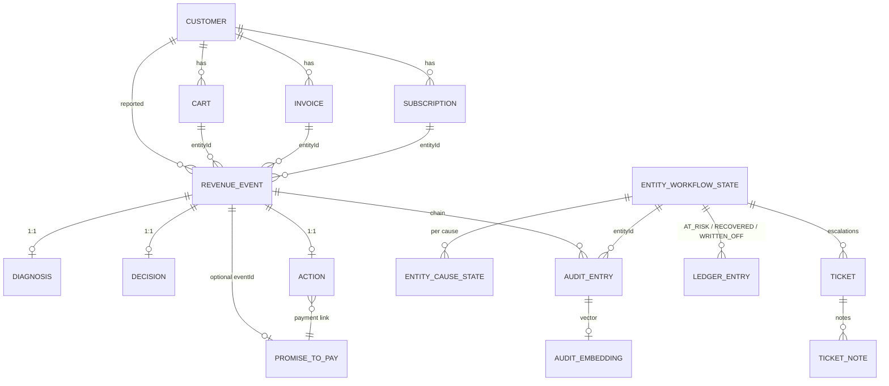

# RazorRecovery — Architecture

#### A Short Human Written Overview

RazorRecovery is a drop in revenue recovery engine designed to integrate with existing company ecosystems without requiring changes to their already established core business services.



When a partner service detects a revenue leakage event, such as an abandoned cart, overdue invoice or a subscription mandate cancellation, it forwards the event to RazorRecovery. From that point, the RazorRecovery engine takes ownership of the recovery workflow, continuously managing the case until the revenue is recovered, written off, or escalated to a human.

For each event, the system uses the customer context and historical behavior, assesses the risk and urgency of the case, diagnoses the likely cause, and determines the most appropriate recovery action. Deterministic business policies and stopping rules provide safety and compliance guardrails, while AI and historical customer data are used when decisions require contextual judgment.

Recovery actions include automated payment reminders, soft chase emails, winback offers, promise to pay tracking, subscription actions, and escalation to human agents. Followups are automatically scheduled based on the state and history of each recovery case, removing the need for manual tracking.

Razorpay payment events are also ingested through webhooks and correlated with recovery cases. Every stage of the recovery lifecycle including incoming events, diagnoses, decisions, actions, failures, and payment outcomes are recorded in a tamper evident, hash chained audit trail, providing a verifiable history of how each entity moved through the recovery pipeline.

In summary, RazorRecovery acts as an autonomous recovery layer between a company's existing services and its payment infrastructure, partner systems report revenue leakage, and RazorRecovery diagnoses, decides, acts, follows up, and tries to recover it.

video link: [click here](https://youtu.be/7U0NI4edSkI?si=YGLM8KKkzlii3t_N)

**Contents:**

1. [Bird's-eye view](#1-birds-eye-view)
2. [Pipeline services](#2-the-pipeline-services-this-is-the-backbone-of-this-system)
3. [Data contracts](#3-data-contracts-between-stages)
4. [Policy & state machine](#4-policy-stopping-rules-and-the-state-machine)
5. [RAG](#5-the-rag-system)
6. [LLM usage](#6-llm-usage)
7. [Razorpay](#7-razorpay-integration)
8. [API](#8-api-endpoints)
9. [Money-path sequence](#9-end-to-end-sequence-the-money-path)
10. [Data model](#10-data-model)
11. [Infrastructure](#11-infrastructure-and-configuration)
12. [Design decisions](#12-design-decisions-and-trade-offs)
13. [Security posture](#13-security-posture---considering-the-scope-of-demo)
14. [Known limitations](#14-known-limitations)
15. [Runbook](#15-runbook-local-dev)
---

## 1. Bird's-eye view

Two external inputs, one internal clock input, one settlement input, and a set of outgoing
integration channels. Between inputs and outputs sits a 6-stage Kafka pipeline.



A failure at any of these stages are never swallowed: the stage logs it and writes a failure audit entry so the trail always shows what happened. It records the complete lifecycle of an event.

---

## 2. Pipeline Services

The pipeline is the backbone of the system. Each service handles one stage of the recovery process and communicates with the next stage through Kafka.

### 2.1 Detection — `kafka/consumers/detectionConsumer.ts`

- **Input:** `revenue.events.raw`
- **Does:** Deduplicates the event using Redis, loads the customer's history, and calculates a deterministic risk score based on amount, severity, history, and urgency. It then stores the event and creates an `AT_RISK` ledger entry in one transaction. Finally, it publishes the enriched event and updates the dashboard through WebSocket.
- **Dependencies:** Postgres, Redis, Kafka, WebSocket.

### 2.2 Diagnosis — `kafka/consumers/diagnosisConsumer.ts`

- **Input:** `revenue.events.enriched`
- **Does:** Determines why the revenue is at risk and assigns one cause from a fixed list. Known conditions such as disputes, mandate issues, and broken promises are handled using deterministic rules. If no rule matches, the service uses the LLM with RAG context to determine the cause. The diagnosis is then stored and published.
- **Dependencies:** Postgres, Kafka, Voyage, OpenRouter.

### 2.3 Decision — `kafka/consumers/decisionConsumer.ts`

- **Input:** `revenue.diagnoses`
- **Does:** Decides what action should be taken in two steps:

  1. **Rules:** Checks conditions such as DNC status, disputes, previous attempts, cooldowns, active promises, and open tickets. This produces the list of actions that are legally allowed.
  2. **LLM:** If multiple actions are allowed, the LLM chooses the most appropriate one using customer information, past cases, and policy rules.

  The final decision is always checked against the allowed actions. If the LLM fails or returns an invalid action, the system falls back to a safe deterministic action.

- **Dependencies:** Postgres, Redis, Kafka, Voyage, OpenRouter.

### 2.4 Executor — `kafka/consumers/executorConsumer.ts`

- **Input:** `revenue.decisions`
- **Does:** Executes the selected action using the appropriate integration.

| Action | Integration | Result |
|---|---|---|
| `send_reminder_email` | Email + Razorpay | Sends a payment reminder with a payment link |
| `send_soft_chase_email` | Email + Razorpay | Sends a softer payment reminder |
| `send_winback_offer` | Email + Razorpay | Sends a discounted payment offer |
| `start_promise_to_pay_tracking` | Promise + Razorpay | Creates a promise-to-pay and sends confirmation |
| `escalate_to_human` | Ticket | Creates a support ticket |
| `pause_subscription` | Razorpay | Pauses the subscription |
| `none` | None | Records the action as skipped |

Unknown actions are recorded as failures and generate an audit entry.

- **Dependencies:** Postgres, Kafka, Razorpay API, SMTP/MailHog.

### 2.5 Audit — `kafka/consumers/auditConsumer.ts`

- **Input:** `revenue.actions`
- **Does:** Records every action in a hash-chained audit trail. Each entry contains the previous hash, making changes to the history detectable.
  It also updates the entity's workflow state, maintains recovery metrics, publishes the audit entry, and updates the dashboard through WebSocket.

- **Dependencies:** Postgres, Redis, Kafka, WebSocket.

### 2.6 Embedding / RAG Indexer — `kafka/consumers/embeddingConsumer.ts`

- **Input:** `revenue.audit`
- **Does:** Indexes only completed cases such as `recovered`, `written_off`, and `escalated`. It creates a compact summary of each case, generates an embedding using Voyage AI, and stores it in PostgreSQL with `pgvector`.
  Each audit entry is indexed only once.

- **Dependencies:** Postgres with pgvector, Voyage API.

### 2.7 Follow-up Scheduler — `scheduler/followUpScheduler.ts`

- **Does:** Runs every 30 seconds and checks ongoing recovery cases. When a cooldown or waiting period expires, it creates a follow-up event and sends it back through the beginning of the pipeline.
  This allows the system to reconsider the case using the latest state and elapsed time. It also handles scheduled retries and promise-to-pay reminders. Redis is used to prevent duplicate follow-ups.
- **Dependencies:** Postgres, Redis, Kafka, SMTP.

### 2.8 Risk & urgency scoring

Computed deterministically in Detection by a pure function (`domain/riskScoring.ts`), no
I/O, no LLM. Both scores are stamped onto the enriched event and surfaced in the dashboard.

```
riskScore = 0.35·normAmount + 0.25·severity + 0.15·historyRisk + 0.25·urgency   (rounded to 3 decimals)
```

| Component | Formula | Notes |
|---|---|---|
| `normAmount` | `min(amount / recentMaxAmount, 1)` | Relative: `recentMaxAmount` is the rolling max event amount over the last 24 h, kept in Redis (`razorrecovery:riskNorm:recentMaxAmount`, 24 h TTL). Missing key falls back to the event's own amount, so the scale self calibrates to the partner's exposure instead of a hardcoded rupee threshold |
| `severity` | fixed per event type | `SUBSCRIPTION_MANDATE_CANCELLED` 0.7 · `INVOICE_OVERDUE` 0.6 · `CHECKOUT_ABANDONED` 0.4 — a prior on how damaging each failure class is |
| `historyRisk` | `min(priorFailures / 5, 1)` | Customer's prior failed-payment events, saturating at 5 |
| `urgency` | time-decayed, per event type | See below |

Urgency is event type specific:

| Event type | Urgency | Intuition |
|---|---|---|
| `INVOICE_OVERDUE` | `min(daysOverdue / 30, 1)` | Ramps to 1.0 at 30 days overdue |
| `CHECKOUT_ABANDONED` | `max(0, 1 − hoursSinceAbandon / 48)` | Decays from 1.0 to 0 across 48 h — stale carts deprioritize themselves |
| `SUBSCRIPTION_MANDATE_CANCELLED` | `0.5` flat | No time signal in the payload |

Worked example: an invoice ₹32,000 overdue 45 days (rolling max = 32,000, first failure)
scores `0.35·1.0 + 0.25·0.6 + 0.15·0 + 0.25·1.0 = 0.75`; a ₹1,899 cart abandoned 2 h ago
against that same rolling max scores ≈ `0.36`. Severity sets a floor per failure class, and
the rolling amount denominator is what makes a ₹2,000 cart and a ₹80,000 invoice comparable.

---

## 3. Data contracts between stages

The wire contracts are plain JSON on Kafka.

### 3.1 Raw event body (what partner services POST)

One versioned envelope for all three partner types (`apiVersion: "1"`, validated with
field-level errors):

```jsonc
{
  "apiVersion": "1",
  "type": "cart",                       // "cart" | "invoice" | "subscription"
  "idempotencyKey": "cart-8842-attempt-1",
  "occurredAt": "2026-09-01T10:38:56Z",
  "customer": { "ref": "cust-2291", "name": "Meera Nair", "email": "meera@example.com", "phone": "+91…" },

  // type === "cart"
  "cart": {
    "ref": "cart-8842", "amount": 18400, "currency": "INR",
    "abandonedAt": "2026-09-01T09:00:00Z",
    "items": [{ "sku": "SKU-9", "name": "Keyboard", "quantity": 1, "unitPrice": 18400 }]
  }

  // type === "invoice" → invoice: { ref, amount, currency, dueDate, disputeFlag }
  // type === "subscription" → subscription: { ref, amount, currency,
  //        mandateStatus: "cancelled|halted|revoked|expired|paused", mandateRef, nextBillDate }
}
```

The ingest service normalizes each type into the same `RawRevenueEvent` (event types:
`CHECKOUT_ABANDONED` / `INVOICE_OVERDUE` / `SUBSCRIPTION_MANDATE_CANCELLED`), computing
derived fields into `rawPayload` (`hoursSinceAbandon`, `daysOverdue`, `disputeFlag`,
`mandate_status`, etc..).

### 3.2 Structures passed along the pipeline

```ts
// revenue.events.raw — published by ingest / scheduler
interface RawRevenueEvent {
  id: string;                      // partner idempotencyKey (ingested) or UUID (synthetic)
  entityType: "CART" | "INVOICE" | "SUBSCRIPTION";
  entityId: string;                // partner ref
  customerId: string;
  eventType: EventType;
  amount: number; currency: string;
  occurredAt: string;
  razorpayPaymentId?: string; razorpayOrderId?: string;
  errorCode?: string; errorReason?: string;
  rawPayload: Record<string, unknown>;
}

// revenue.events.enriched — detection adds two scores
interface EnrichedRevenueEvent extends RawRevenueEvent { riskScore: number; urgency: number }

// revenue.diagnoses — { event: EnrichedRevenueEvent, diagnosis: DiagnosisResult }
interface DiagnosisResult {
  causeLabel: string;                       
  confidence: number;                       
  method: "RULE" | "LLM";
  reasoning?: string;
}

// revenue.decisions — { event, diagnosis, decision }
interface DecisionResult {
  legalActions: string[];                   
  chosenAction: string;                     
  reasoning: string;                        
  policyVersion: string;                    
}

// revenue.actions — { event, diagnosis, decision, action }
interface ActionResult {
  actionType: string;
  result: "success" | "failed" | "skipped" | "scheduled" | "cancelled";
  integration: "RAZORPAY" | "EMAIL" | "TICKET" | "PROMISE" | "NONE";
  razorpayPaymentLinkId?: string; paymentLinkUrl?: string; paymentId?: string;
  emailMessageId?: string; detail?: string;
}
```

Every stage also writes its snapshot into the **audit entry** (`inputSnapshot`,
`diagnosisSnapshot`, `decisionSnapshot`, `actionSnapshot`, `outcome`, `timestamp`, `prevHash`,
`hash`). The dashboard timeline and the RAG store both read from it.

---

## 4. Policy, stopping rules, and the state machine

**Policy** (`domain/policy.json`, loaded by `domain/policy.ts`):

| Cause | Legal actions | Extras | Stopping rules |
|---|---|---|---|
| `cart_abandoned` | reminder, escalate | escalate above ₹10,000 (LLM may justify deviation) | max 2 attempts / 7 days → escalate |
| `invoice_overdue` | reminder, soft chase, escalate | — | max 3 attempts / 7 days → escalate |
| `mandate_requires_reauthorization` | reminder, winback, pause, escalate | winback 20% discount | hard stop 30 days → escalate |
| `no_reason_signal` | reminder | — | no-response 48 h |
| `promise_broken` | escalate | — | max 1 attempt |

**Stopping rules** (`domain/stoppingRules.ts`): hard overrides first — recovered,
escalated, DNC, disputed, broken promise, active promise → empty or single-action lists;
then per-cause counters (cooldown, max attempts, no-response, hard stop) prune the list.
Returns `actions` + a structured `blockedBy` reason that flows into the audit trail.

**State machine** (`domain/stateMachine.ts`): every entity has one workflow state.
Terminal states have zero outgoing edges; a later event on a terminal entity starts a new arc.



---

## 5. The RAG system

**Purpose:** let the intelligence stages learn from completed recovery cases instead of
re-deciding in a vacuum.

* **Indexing (write path):** The `embedding-service` reads completed cases from `revenue.audit` and indexes only final outcomes. It creates a consistent case summary, generates a 1024-dimensional embedding using Voyage AI (`voyage-3`), and stores it in PostgreSQL with `pgvector`. Each audit entry has one unique embedding.

* **Retrieval (read path):** When a new case needs context, `retrievalService` creates a summary of the case and searches pgvector for the 3 most similar past cases using cosine similarity. The search considers the cause, entity type, and amount, with amounts grouped into broad ranges. The results include the past case's cause, action taken, outcome, and recovery time.


**Who uses it and when:**

| Module | When | What it injects |
|---|---|---|
| Diagnosis (`diagnosisService.ts`) | Only when no deterministic rule matches | `similar_past_cases` as historical context for classification |
| Decision (`decisionService.ts`) | Only when 2+ actions are legal | `similar_past_cases` with outcome + days-to-recover |
| Audit Q&A (`queryService.ts`, `POST /query`) | On every natural-language question | Top-k audit entries by cosine similarity to the question |

All three degrade gracefully: if Voyage is unkeyed or retrieval fails, the call proceeds
without RAG context (logged, never fatal).

---

## 6. LLM usage

All LLM traffic goes through one boundary, `config/openai.ts` — an OpenAI-compatible Chat
Completions client pointed at **OpenRouter** (`LLM_BASE_URL`, default
`https://openrouter.ai/api/v1`, model `LLM_MODEL`). Structured outputs (JSON schema) with
automatic degradation to plain prompting, 429 backoff, retry loop.

| Call site | When | Output | Failure behavior |
|---|---|---|---|
| Diagnosis (`DIAGNOSIS_SYSTEM_PROMPT`) | No deterministic rule matched the event | `cause_label` + confidence + reasoning (JSON-schema `revenue_diagnosis`) | One corrective retry, then deterministic fallback `no_reason_signal` (RULE, 0.5) |
| Decision (`DECISION_PROMPT`) | 2+ legal actions and no deterministic shortcut | `chosen_action` + reasoning (JSON-schema `recovery_decision`) | Re-validate against legal set; fallback = first legal action, or `escalate_to_human` above the policy escalation threshold |
| Audit Q&A (`queryService.requestText`) | User asks a question on `/query` | Free-text answer with `[entity:<id>]` citations | Typed error as response |

Deterministic paths never call the LLM: rule based diagnosis, zero/one legal actions,
lapsed scheduled retries, and all fallbacks.

---

## 7. Razorpay integration

The system uses it in two directions:

**Inbound — settlement webhook** (`POST /webhooks/razorpay`, `api/webhooks/razorpayWebhook.ts`, `services/webhookService.ts`):
1. HMAC-SHA256 signature verification against `RAZORPAY_WEBHOOK_SECRET` (timing-safe compare).
2. Handles `payment.captured` and `payment_link.paid`.
3. Matches the payment to a recovery arc: `Action.razorpayPaymentLinkId` → `Ticket` link →
   `RevenueEvent` (payment/order id, notes `entity_id`/`event_id`) → `PromiseToPay` link.
4. If matched: transaction marks the entity **RECOVERED** (workflow state + Redis marker),
   marks open promises **kept**, auto-resolves open tickets with notes, writes a `RECOVERED`
   ledger entry, and appends a chained audit entry (actor `razorpay_webhook`). Duplicate
   settlements are idempotent (`already_recovered`).
5. Unmatched payments settle **standalone promises** (promise manually created from the dashboard).

**Outbound — `integrations/razorpayIntegration.ts` + `services/paymentLinkService.ts`:**
- `getOrCreatePaymentLink` — one Razorpay payment link per entity, reused across actions,
  with notes (`entity_id`, `event_id`, `promise_id`) that make webhook matching deterministic.

---

## 8. API endpoints

Mounted in `api/server.ts`. All responses are JSON; domain errors become typed HTTP errors in
one place (`utils/apiResponse.ts`).

| Endpoint | What it does |
|---|---|
| `GET /health` | Liveness probe |
| `POST /api/v1/events` | **Partner ingest** (header `x-api-key`): validates envelope, dedups, upserts customer/entity, publishes to `revenue.events.raw` |
| `POST /webhooks/razorpay` | **Signed Razorpay settlement webhook** |
| `GET /entities` | Filterable, paginated recovery-arc list (state, cause, amount, search, window) |
| `GET /entities/:id/audit` | Full detail for one entity: events, workflow state, promises, hash-chained audit timeline |
| `POST /entities/:id/escalate` | Manual operator escalation → ticket + audit entry (`dnc_manual_override` semantics) |
| `GET /metrics/summary?window=` | Live funnel, recovered/at-risk/write-off amounts, per-cause and per-channel breakdowns, compliance counters |
| `GET /metrics/trend?window=` | Time-bucketed trend series |
| `GET /policy` | Current policy.json + DNC list + compliance log |
| `GET /audit/verify` | Re-walks the hash chain and reports whether it is intact |
| `POST /query` | Natural-language Q&A over the audit trail (RAG + LLM, cited entity ids) |
| `GET /tickets`, `GET /tickets/stats`, `GET /tickets/:id` | Ticket list / stats / detail |
| `POST /tickets/:id/notes` · `/send-email` · `/resolve` | Agent notes, customer email (with payment link), resolve/recover/write-off |
| `GET /promises`, `GET /promises/:id`, `GET /promises/stats` | Promise-to-Pay list / detail / stats |
| `POST /promises` | Create standalone promise (confirmation email + payment link) |
| `POST /promises/:id/send-reminder` | Send reminder email for a pending promise |
| `PATCH /promises/:id` | Update promise (amount, date, status) |

**WebSocket** (`api/websocket.ts`) pushes three events to the dashboard:
`event:incoming` (new event detected), `activity:new` (audit entry appended),
`metrics:update` (recomputed live metrics).


---

## 9. End-to-end sequence: the money path

The full lifecycle of one recovered entity, promise-to-pay variant, which is the longest path:



Payment-on-email and payment-on-ticket variants skip the promise rows. the webhook's
matching cascade handles all three from the same Razorpay link notes.

---

## 10. Data model

Prisma source: `backend/prisma/schema.prisma` (Postgres, `pgvector` extension). Grouped by role:

| Group | Models | Notes |
|---|---|---|
| Partners | `Customer`, `Cart`, `Invoice`, `Subscription` | Entity row ID = partner ref; customer deduped by email |
| Pipeline | `RevenueEvent` → `Diagnosis` → `Decision` → `Action` | 1 : 1 (1 event, one row per stage); `Action` carries integration + payment link IDs |
| Audit | `AuditEntry`, `AuditChainHead`, `AuditEmbedding` | Chain head is a single row (id 1); embeddings vector(1024), unique per entry |
| Workflow | `EntityWorkflowState`, `EntityCauseState` | One arc state per entity; per cause counters (attempts, cooldown, last contact) |
| Operations | `LedgerEntry`, `Ticket`, `TicketNote`, `PromiseToPay` | Money ledger; human escalations; promise lifecycle |



Enums: `EntityType`, `EventType`, `WorkflowState`, `DiagnosisMethod` (`RULE`/`LLM`),
`ActionIntegration` (`RAZORPAY`/`EMAIL`/`MOCK`/`TICKET`/`PROMISE`/`NONE` — `MOCK` is legacy,
read-only), `LedgerEntryType`, `PromiseStatus`.

---

## 11. Infrastructure and configuration

| Dependency | Used for |
|---|---|
| **Postgres + pgvector** | System of record (customers, entities, events, diagnoses, decisions, actions, audit chain, ledger, promises, tickets) + vector store for RAG |
| **Kafka** (`kafkajs`, Redpanda-compatible) | The 6 pipeline topics; one consumer group per stage |
| **Redis** | Ingest idempotency (7-day TTL), per-stage dedup, cooldown TTLs, recovered markers, rolling risk-normalization max, metric cache |
| **SMTP (MailHog in dev)** | All outbound email |
| **Razorpay (Test Mode)** | Payment links, subscription pause, signed settlement webhooks |
| **OpenRouter** (OpenAI-compatible) | Diagnosis, decision, audit Q&A |
| **Voyage AI** (`voyage-3`) | Case embeddings for RAG (optional — pipeline runs without it) |

Configuration is environment-only (`config/env.ts`, zod-validated):
`DATABASE_URL`, `REDIS_URL`, `KAFKA_BROKERS`, `KAFKA_CLIENT_ID`, `RAZORPAY_KEY_ID`,
`RAZORPAY_KEY_SECRET`, `RAZORPAY_WEBHOOK_SECRET`, `PARTNER_API_KEY`, `LLM_API_KEY`,
`LLM_MODEL`, `LLM_BASE_URL`, `VOYAGE_API_KEY`, `VOYAGE_MODEL`, `SMTP_HOST`,
`SMTP_PORT`, `SMTP_FROM`, `PORT`, `CORS_ORIGIN`.

Boot order (`src/index.ts`): Kafka producer → HTTP server (dashboard availability never
depends on consumer rebalancing) → the six consumers in parallel → follow-up scheduler.
Graceful shutdown drains everything on SIGINT/SIGTERM.

---

## 12. Design decisions and trade-offs

| Decision                           | Why we chose it                                                                                   | Trade-off                                                                       |
| ---------------------------------- | ------------------------------------------------------------------------------------------------- | ------------------------------------------------------------------------------- |
| **Kafka for each stage**           | Each stage can run and restart independently, and events can be replayed.                         | More infrastructure and each stage needs duplicate event handling. which we have implemented here.              |
| **pgvector for RAG**               | Keeps vector search inside Postgres, so we don't need another vector database.                           | May need reindexing if the data grows significantly.                            |
| **Hash-chained audit log**         | Makes it possible to detect if audit records were changed.                                        | Audit writes are serialized, which limits throughput. So a bottle neck.                           |
| **Money stored as Float**          | Simple for this build and avoids extra conversion logic.                                          | Can cause rounding problems as we know. |
| **Policy stored as JSON**          | Simple, versioned, and requires no extra infrastructure.                                          | Policy changes require a deployment.                                            |
| **Consumers in one process**       | Keeps development and demos simple while retaining separate Kafka consumer groups.                | One process failure affects all stages.                                         |
| **AI-based escalation**            | Lets the system consider customer value instead of using a simple hard cutoff.                    | AI decisions can be subjective, so they are recorded in the audit log.          |


---


## 13. Security posture - Considering the scope of Demo

| Area | State |
|---|---|
| **Partner ingest auth** | Shared `PARTNER_API_KEY` via `x-api-key`; compared as SHA-256 digests with `crypto.timingSafeEqual` (no plaintext comparison). Single shared key, not per-partner — fine for one integration, first gap for multi-tenancy |
| **Webhook auth** | HMAC-SHA256 over the raw body against `RAZORPAY_WEBHOOK_SECRET`, timing-safe compare, verified before parsing/processing |
| **Dashboard / operator API** | **Unauthenticated** (CORS-restricted to the frontend origin only). The escalation endpoint `POST /entities/:id/escalate` is a state-changing, unauthenticated route — the top production hardening item |
| **Secrets** | Environment-only, zod-validated at boot (fail-fast); nothing hardcoded |
| **PII** | Customer PII is masked by `domain/redaction.ts` helpers (unit-tested); **not yet enforced on `/query` output** — known gap. LLM payloads (OpenRouter) carry amounts, ids, and reasoning context, not raw PII fields beyond names |

---

## 14. Known limitations

Considering the time provided for buildathon, and the priority to build a working engine. would like to menstion these.

1. **No authentication on operator/dashboard endpoints** — including the escalation route.
2. **No DLQ / message redelivery** — poison messages are parked as failed audit entries.
3. **`Float` money** — rounding-safe enough for demo aggregation, not for real settlement.
4. **Single shared partner API key** — no per-partner credentials or rate limiting on ingest.
5. **Policy is file-based** — no hot reload, no DB-backed policy or A/B rules.
6. **RAG cold start** — with few completed cases, `findSimilarCases` returns little; quality
   grows with the corpus. IVFFlat `lists = 100` should be reindexed as it grows.
7. **Synthetic follow-up events inherit the last event's error signals** — correct for
   cooldown retries, but a stale signal if the partner-side state changed meanwhile.
8. **No telemetry or log aggregation** — observability is the audit trail and console olgs for now, Prometheus and Grafana is an easy drop in.

---

## 15. Runbook (local dev)

```bash
docker compose up -d          # postgres (:5432), redis (:6379), redpanda (:9092), mailhog (:1025/8025)
cd backend
cp ../.env.example ../.env    # fill secrets (Razorpay test keys, OpenRouter, Voyage)
npm run migrate && npm run reset   # schema + clean demo dataset (@example.test customers)
npm run dev                   # backend on :4000 — API + WS + all 6 consumers + scheduler
npm run create-topics         # once, if topics don't auto-create
cd ../frontend && npm run dev # dashboard on :3000; MailHog UI on :8025
```

Useful scripts (`backend/package.json`):

| Script | Purpose |
|---|---|
| `npm run demo` | Enter-driven demo: injects the 11-step event sequence through the real ingest API |
| `npm run reset` | Clean DB + reseed demo customers |
| `npm run test:integrations` | Smoke Razorpay / SMTP / LLM / Voyage connectivity |
| `npm run test:webhook` / `test:promise-payment` | Fire a signed settlement webhook for an entity |
| `npm run pay:ticket` | Simulate payment for a ticket-linked payment link |
| `npm run tamper` | Mutate an audit row to demonstrate hash-chain detection via `/audit/verify` |
| `npm run healthcheck` | Probe backend + dependencies |
| `npm run clean` | Wipe pipeline data (keeps schema) |
| `npm test` | Jest suite (256 tests, 22 suites) |
